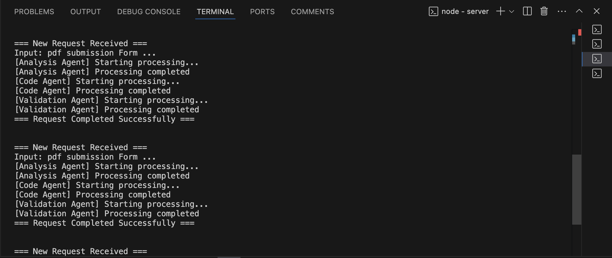

# AI-Powered Code Generator

An interactive web application that uses TinyLlama via Ollama to automatically generate landing pages and forms based on natural language descriptions.





## 🌟 Features

- **Natural language to code**: Convert text descriptions into functional HTML, CSS, and JavaScript
- **Real-time analysis**: AI-powered analysis of requirements
- **Code validation**: Automatic review for security, accessibility, and best practices
- **Live preview**: Instantly see how your generated code renders
- **Code editing**: Modify the generated code directly in the browser
- **Dark/Light mode**: Choose your preferred UI theme

## 📋 Table of Contents

- [Demo](#-demo)
- [Architecture](#-architecture)
- [Setup Instructions](#-setup-instructions)
- [Usage Guide](#-usage-guide)
- [How It Works](#-how-it-works)
- [Sample Prompts](#-sample-prompts)
- [Contributing](#-contributing)
- [License](#-license)

## 🎮 Demo


The application provides an intuitive interface where users can:
1. Enter a description of what they want to build
2. Watch as the AI analyzes their request
3. See the generated HTML, CSS, and JavaScript
4. Preview the result in real-time
5. Edit the code if needed

## 🏗 Architecture

This project implements a client-server architecture:

```
┌─────────────┐     REST API     ┌─────────────┐     API      ┌─────────────┐
│  React      │<---- ------- ----->│  Express.js │<- ------ ----->│   Ollama    │
│  Frontend   │  JSON Responses  │  Backend    │  TinyLlama   │  AI Engine  │
└─────────────┘                  └─────────────┘              └─────────────┘
```

- **Frontend**: React with Bootstrap for UI, Monaco Editor for code editing, and also Tailwindcss
- **Backend**: Express.js server that handles requests and coordinates with Ollama
- **AI Engine**: Ollama running TinyLlama model for text generation

## 🚀 Setup Instructions

### Prerequisites

- Node.js (v14+)
- npm or yarn
- [Ollama](https://ollama.ai/) installed locally

### Backend Setup

1. Clone the repository:
   ```bash
   git clone https://github.com/yourusername/ai-code-generator.git
   cd ai-code-generator/server
   ```

2. Install dependencies:
   ```bash
   npm install
   ```

3. Install and start Ollama:
   ```bash
   # Follow installation instructions at https://ollama.ai/
   # Then pull the TinyLlama model
   ollama pull tinyllama
   ```

4. Start the backend server:
   ```bash
   npm start / node index.js
   ```
   The server will run on `http://localhost:5001`

### Frontend Setup

1. Navigate to the frontend directory:
   ```bash
   cd ../client
   ```

2. Install dependencies:
   ```bash
   npm install
   ```

3. Start the development server:
   ```bash
   npm run dev
   ``` 
   The frontend will be available at `http://localhost:3000` || `http://localhost:5173`

## 📝 Usage Guide

1. **Enter a prompt**: Describe the landing page or form you want to create in the input field
2. **Generate code**: Click the "Generate Code" button and wait for the AI to process your request
3. **View results**: Examine the generated HTML, CSS, and JavaScript in the code editor tabs
4. **Preview the output**: Click "Switch to Preview" to see how your page looks
5. **Edit if needed**: Use the "Edit Code" button to make modifications
6. **Save changes**: Click "Save Changes" after editing
7. **Copy code**: Use the "Copy" button to copy code to your clipboard

## ⚙️ How It Works

The application follows a 3-step process:

1. **Analysis**: The AI analyzes your requirements and identifies needed components, features, and considerations
2. **Code Generation**: Based on the analysis, it generates HTML, CSS, and JavaScript code
3. **Validation**: The generated code is reviewed for security issues, accessibility concerns, and best practices

### Backend Processing Flow

```
User Request → Analysis Agent → Code Generation Agent → Validation Agent → Response
```

The backend uses three AI "agents" that each perform a specific function in the pipeline:

```javascript
// Example of the aiAgent function that powers the system
async function aiAgent(model, prompt, system, agentName) {
  console.log(`[${agentName}] Starting processing...`);
  try {
    const response = await axios.post(`${OLLAMA_HOST}/api/generate`, {
      model,
      prompt,
      system,
      stream: false,
      options: { temperature: 0.7 }
    });
    console.log(`[${agentName}] Processing completed`);
    return response.data.response;
  } catch (error) {
    console.error(`[${agentName}] Error: ${error.message}`);
    throw new Error(`${agentName} failed: ${error.message}`);
  }
}
```

## 📋 Sample Prompts

### Contact Form
```
Create a responsive contact form with the following fields:
- Name (required)
- Email (required, with validation)
- Phone number (optional)
- Message (required, textarea)
- Submit button

Use a clean, modern design with blue as the primary color. Include form validation with JavaScript and show error messages.
```

### Product Landing Page
```
Create a landing page for a new smartphone called "TechX Pro" with these sections:
1. Hero section with a large product image, headline, and "Buy Now" button
2. Features section highlighting 3 key features with icons
3. Technical specifications in a clean, easy-to-read table
4. Customer testimonials (3 quotes)
5. Pricing information with a comparison to competitors
6. Contact form at the bottom

Use a dark theme with accent colors of purple and teal. Make sure it's fully responsive.
```


## 🛠 Core Files

### Backend (Express.js)

```javascript INDEX.JS
// index.js - Main backend file
import express from 'express';
import cors from 'cors';
import axios from 'axios';

const app = express();
app.use(cors());
app.use(express.json());

const OLLAMA_HOST = process.env.OLLAMA_HOST || 'http://127.0.0.1:11434';

// Health-check route
app.get('/api/health', async (req, res) => {
  try {
    await axios.get(`${OLLAMA_HOST}/api/tags`);
    res.json({ 
      status: 'Ollama service is healthy',
      version: '1.0.1',
      theme: 'light'
    });
  } catch (error) {
    res.status(503).json({ 
      error: 'Ollama service unavailable',
      solution: '1. Ensure Ollama is running\n2. Run: ollama pull tinyllama'
    });
  }
});

// Main API endpoint for code generation
app.post('/api/process-request', async (req, res) => {
  console.log('\n=== New Request Received ===');
  try {
    // Analysis step
    const analysis = await aiAgent(
      'tinyllama',
      `Analyze this homepage requirement: ${req.body.requirement}`,
      'Identify needed sections, features, and security considerations',
      'Analysis Agent'
    );

    // Code generation step
    const code = await aiAgent(
      'tinyllama',
      `Generate a complete landing page code based on the analysis: ${analysis}`,
      'Include Bootstrap-compatible HTML, responsive CSS, and JS if needed',
      'Code Agent'
    );

    // Validation step
    const validation = await aiAgent(
      'tinyllama',
      `Review the code for security and best practices: ${code}`,
      'Provide a brief summary of issues and improvements',
      'Validation Agent'
    );

    // Extract code blocks and send response
    const codeBlocks = extractCodeBlocks(code);
    res.json({ 
      analysis: analysis.trim(),
      html: codeBlocks.html,
      css: codeBlocks.css,
      js: codeBlocks.js,
      validation: validation.trim()
    });
  } catch (error) {
    res.status(500).json({ error: error.message });
  }
});

const PORT = 5001;
app.listen(PORT, () => {
  console.log(`\n🚀 Server running on port ${PORT}`);
});
```

### Frontend (React)

```javascript  APP.JSX
// App.jsx - Main frontend component
import { useState } from 'react';
import Editor from '@monaco-editor/react';
import { ToastContainer, toast } from 'react-toastify';
import { Tabs, Tab } from 'react-bootstrap';

export default function App() {
  const [input, setInput] = useState('');
  const [output, setOutput] = useState({});
  const [loading, setLoading] = useState(false);
  const [viewMode, setViewMode] = useState('code');
  
  const handleSubmit = async () => {
    setLoading(true);
    try {
      const response = await fetch('http://localhost:5001/api/process-request', {
        method: 'POST',
        headers: { 'Content-Type': 'application/json' },
        body: JSON.stringify({ requirement: input })
      });
      
      const data = await response.json();
      setOutput(data);
      toast.success('Code generated successfully!');
    } catch (error) {
      toast.error('Failed to generate code');
    } finally {
      setLoading(false);
    }
  };
  
  // Rendering code and preview components...
}
```

## 📷 Screenshots

### Main Interface


### Code Generation Process


### Live Preview


## 🤝 Contributing

Contributions are welcome! Please feel free to submit a Pull Request.

1. Fork the repository
2. Create your feature branch (`git checkout -b feature/amazing-feature`)
3. Commit your changes (`git commit -m 'Add some amazing feature'`)
4. Push to the branch (`git push origin feature/amazing-feature`)
5. Open a Pull Request

## 📄 License

This project is licensed under the MIT License - see the [LICENSE](LICENSE) file for details.

## 🙏 Acknowledgements

- [Ollama](https://ollama.ai/) for the local AI models
- [TinyLlama](https://github.com/jzhang38/TinyLlama) project
- [React](https://reactjs.org/) for the frontend framework
- [Express](https://expressjs.com/) for the backend server
- [Monaco Editor](https://microsoft.github.io/monaco-editor/) for the code editor component